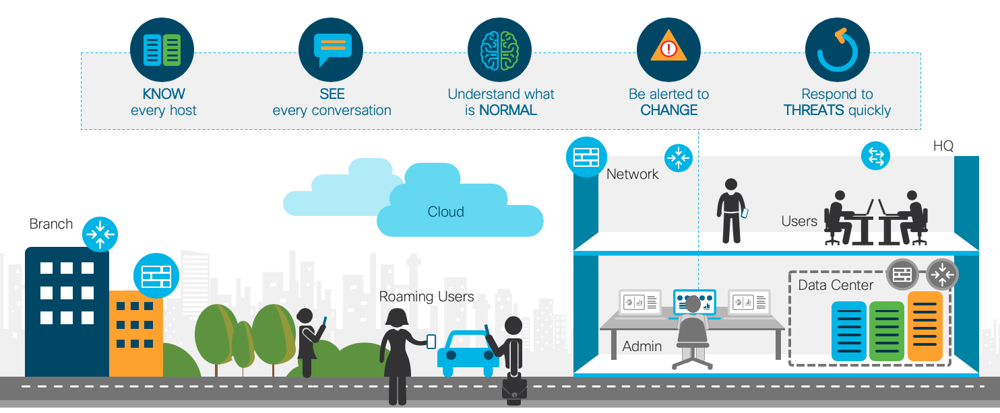
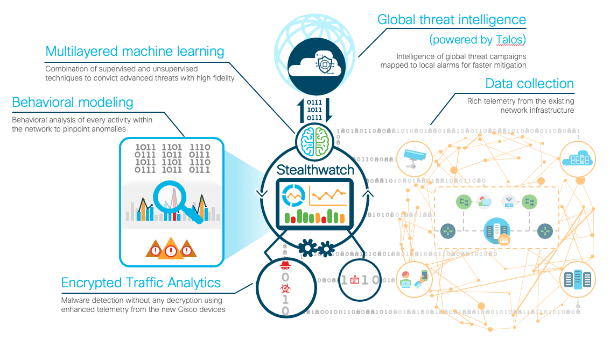

# Intro to Cisco Secure Network Analytics
In this lab you will lay a theoretical foundation for the coming hands-on labs. Please read the below information before continuing. 

## Objectives

The objective of this lab is to:

* Learn what Cisco Secure Network Analytics is;
* Learn about network traffic visibility;
* Learn more about the data collection and machine learning analytics that is performed.

## What is Cisco Secure Network Analytics?

Digitization introduces significant benefits, but it also increases complexity and has the potential to create network security blind spots. The enterprise attack surface is growing:

* **Enterprise Mobility**: Employees want to work from anywhere on any device. Organizations lack visibility into the behavior of devices on their network.
* **Acquisitions and Partnerships**: Enterprises Threats can move between branches and to headquarters
* **Cloud**: A lack of visibility into the public cloud means that many security professionals believe that data in the public cloud is the biggest source of concern related to cyber attacks.
* **Internet of Things**: Many smart devices may connect to the enterprise network.
* **Encrypted Traffic**: Organizations are increasingly using encryption for data protection and privacy. However, if an organization cannot decrypt HTTPS, they will not detect targeted web malware.

At the same time, threats are evolving and getting smarter:

* **Motivated and targeted adversaries**: Adversaries are not only interested in revenue generation from attacks; they may also destroy services and data completely to disrupt the business or commit espionage. Attackers interested in stealing critical information want to get in, get the data, and get out undetected so that they can continue to persist.
* **Insider Threats**: It is often said that attackers are logging in instead of breaking in. Insider threats include disgruntled employees, insecure admin or privileged accounts, or credentials compromised by phishing, theft or negligence. Insider threats are extremely difficult to detect.
* **Increased attack sophistication**: Adversaries attack through malware, spyware, and ransomware as well as vulnerabilities in the infrastructure. Attacks can take the form of advanced persistent threats, encrypted malware and zero-day exploits.

## Secure Network Analytics and traffic visibility

Businesses must have visibility into their entire network infrastructure and be able to take action quickly in order to minimize the impact of a threat on critical information.

The solution is Secure Network Analytics, which enlists the network to provide end-to-end visibility into traffic. With Secure Network Analytics, you gain total visibility across every security touchpoint.

This visibility includes knowing every host and seeing who is accessing what information at any given point. You need to recognize normal behavior for a particular user or host and establish a baseline, which enables instant alerts to changes in the user’s behavior.

## Secure Network Analytics Security Analytics

There are five main elements part of the Security Analytics that provide the ability to detect advanced threats in real time:

### Data collection

Routers, switches, firewalls, and other network components can deliver rich telemetry. With Encrypted Traffic Analytics, Secure Network Analytics can also analyze encrypted traffic to detect malware without decryption and govern the quality of network encryption within your digital business.

Secure Network Analytics also collects metadata from Cisco Identity Services Engine (ISE), Cisco AnyConnect Network Visibility Module (NVM), and other supporting systems to make sure you have user and application context to the network behavioral analytics.

Secure Network Analytics acts as a "general ledger" for your digital business ensuring that you have an account of who, what, where, when, and how everything is behaving over time.  

### Behavioral modeling

Secure Network Analytics closely monitors the activity of every device on the network and is able to create a baseline of normal behavior. Secure Network Analytics also has a deep understanding of known bad behavior. This is implemented by applying close to 100 different Security Events or heuristics to look at many types of traffic behavior.

### Multilayered machine learning

Secure Network Analytics also applies supervised and unsupervised machine learning to discover advanced threats and malicious communications. It integrates with a cloud based multi-stage machine learning analytics pipeline that correlates threat behaviors seen in the enterprise with those seen globally.

### Global Threat Intelligence

The industry-leading threat intelligence group [Cisco Talos](https://www.talosintelligence.com/) powers a global threat intelligence feed that provides an additional layer of protection against botnets and other sophisticated attacks.

It correlates suspicious activity in the local network environment with data on thousands of known command-and-control servers and campaigns. This intelligence provides high fidelity detection and faster threat response. Cisco Talos sees 1.5 million unique malware samples daily and blocks 20 billion threats per day.

### Encrypted Traffic Analytics

Secure Network Analytics is the only solution that can analyze encrypted traffic without decryption. It uses the enhanced telemetry from the new Cisco network and applies a combination of advanced analytics to detect malware and ensure crypto compliance.

## Secure Network Analytics features

Cisco Secure Network Analytics uses the different analytics to provide the following features.

### Contextual network-wide visibility

Secure Network Analytics ingests and analyzes telemetry from multiple network devices on premises. It also natively collects telemetry from the public cloud infrastructure. Secure Network Analytics uses entity modeling to classify all the devices or entities connected to the network, including servers, printers, and more.

Secure Network Analytics can provide contextual information about the source of the threat, including where it might have propagated, which user has been compromised, and other info such as location, device type, time-stamp, and more. Secure Network Analytics can also store telemetry for a specified period of time, which enables forensic investigation of past or long-running events through integrations with other security solutions. This enables analysis of user and application data, web information, and more for faster threat investigation and response.

### Predictive threat analytics

Cisco Secure Network Analytics constantly observes network activities to create a baseline of normal behavior, and uses up to 100 different heuristics to generate alarms on any anomalies. It also generates alarms from knowledge of known bad behavior. For example, if attackers use lost or stolen credentials to gain access, or a malicious employee hoards or exfiltrates sensitive data, Secure Network Analytics can generate an alarm on it right away.

Secure Network Analytics also uses cloud-based machine learning techniques to detect advanced threats and malicious campaigns. These techniques identify malicious servers across the world and flag any communication to them.

Secure Network Analytics uses global threat intelligence powered by the industry-leading Talos platform to correlate local threats globally, and thwart attackers’ rinse-and-repeat tactics of infecting multiple victims with the same malware.

### Automated detection and response

The combination of this context-driven enterprise-wide visibility and the application of advanced analytical techniques leads to advanced, high-fidelity threat detection. Security teams see alarms that are prioritized by threat severity, and have additional information to take actions easily. An alarm can have an associated response:
    * Notify in the alarm table
    * Generate an email
    * Generate a syslog message to a SIEM
    * Quarantine identified threats using the network (Containment through Adaptive Network Control using ISE integration)

**Next Step: Intro to the dataset and Pandas**