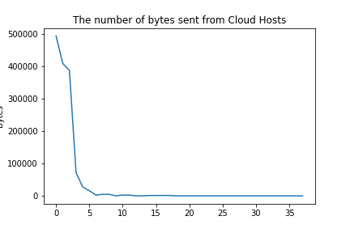

# Hands-on excercise: detect above-average flows
In the last step, we will create a script that can detect above-average flows. 

## Objectives

After this step, you should be able to:
* Learn how to plot using `matplotlib.pyplot`
* Compare values and return a value based on this comparison. 

## Let's detect the outliers!

Let's take a closer look at our DataFrame and see whether we can detect outliers among the data we collected. 

1. Usually, we start by inspecting the data manually in order to get a feel for the data. We can use the `matploblib.pyplot` library for this. We plot the number of bytes sent and received per hostgroup. 

```python
def plot_flows(aggregates_dict, sent_or_received):
    for subject_host_group in aggregates_dict:
        plt.figure()
        x = np.arange(len(aggregates_dict[subject_host_group]))
        y = np.array(aggregates_dict[subject_host_group])

        plt.plot(x,y)
        plt.title(f'The number of bytes {sent_or_received} from {subject_host_group}')
        plt.ylabel('Bytes')
        
        plt.show()
```





From the output above, we can see that there are some clear outliers that are heavily influencing the averages. 


**Next Step: Wrap-Up**