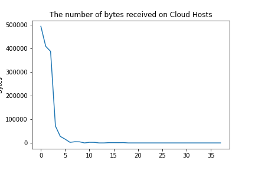
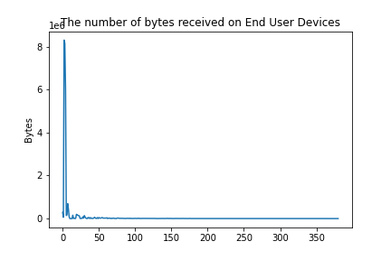
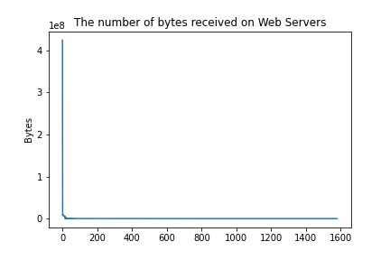
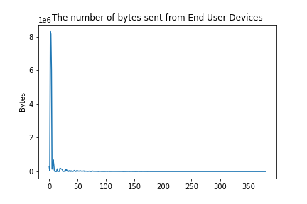

# Detect above-average flows

In the last exercise, we create a script that can detect above-average flows. 

* Learn how to plot using `matplotlib.pyplot`
* Compare values and return a value based on this comparison. 
* Learn how to use the `sort_values()` method of `pandas`.
* Learn how to top outliers of a DataFrames.

## Detect the outliers in the data

Take a closer look at the DataFrame and try to detect outliers among the collected data. 

1. Usually, you start by inspecting the data manually to get a feel for the data, using the `matploblib.pyplot` library. This code plots the number of bytes sent and received per host group: 

```python
def plot_flows(aggregates_dict, sent_or_received):
    for subject_host_group in aggregates_dict:
        plt.figure()
        x = np.arange(len(aggregates_dict[subject_host_group]))
        y = np.array(aggregates_dict[subject_host_group])

        plt.plot(x,y)
        plt.title(f'The number of bytes {sent_or_received} from {subject_host_group}')
        plt.ylabel('Bytes')
        
        plt.show()
```








From this output, you can see that there are some clear outliers that are heavily influencing the averages. 

2. Now you can filter out the anomalies / outliers in the DataFrame. We are first filtering out the flows with our specified host group, and then sorting this in descending order. We are then only printing the top outliers (which is set to 5: `number_of_outliers=5`):

```python
def detect_top_outliers(df, sent_or_received, number_of_outliers):
    peer_or_subject_bytes = check_sent_or_received(sent_or_received)
    
    for host_group in df['Subject Host Groups'].unique():
        filtered_df = df[df['Subject Host Groups'] == host_group]
        filtered_df = filtered_df.sort_values(by=[peer_or_subject_bytes], ascending=False)[:number_of_outliers]
        print(filtered_df)
```

3. Go ahead and try it out yourself! Inspect the anomalies manually and try to understand what is happening for each situation. Uncomment the below lines by deleting the `#TODO ` to execute the anomalies. 

```python
# Hands-on excercise: detect above-average flows
#TODO plot_flows(total_sent, 'sent')
#TODO plot_flows(total_received, 'received)
#TODO detect_top_outliers(df, sent_or_received="sent", number_of_outliers=5)
#TODO detect_top_outliers(df, sent_or_received="received", number_of_outliers=5)
```

4. As you can see we are now requesting the top 5 outliers per Subject Host Group. This is something that Secure Network Analytics does in a way as well (but then much more advanced). As you can see below we have the top 5 outliers from the `Web Servers` host group. This is done There is 1 outlier that is very interesting, since it is a flow towards a public IP. This could indicate that this host is compromised, and a malicious actor is trying to exfiltrate data.

```
Start	Duration	Subject IP Address	Subject Port/Protocol	Subject Host Groups	Subject Bytes	Application	Total Bytes	Peer IP Address	Peer Port/Protocol	Peer Host Groups	Peer Bytes	Actions
0	2021-05-11T03:40:03.000+0000	7hr 57min 56s	10.201.3.20	50928/TCP	Web Servers	424390000	Xsan Filesystem	0	10.201.1.51	22609/TCP	Web Servers	424390000	
7	2021-05-11T03:40:15.000+0000	7hr 57min 40s	10.201.1.163	16384/UDP	Web Servers	9790000	Quicktime	0	10.202.5.2	9055/UDP	Cloud Hosts	0	
3	2021-05-11T11:36:40.000+0000	1min 19s	10.201.3.40	52793/TCP	Web Servers	8230000	HTTP (unclassified)	0	206.190.57.69	80/TCP	United States	12080000	
8	2021-05-11T03:40:59.000+0000	7hr 57min	10.201.1.163	16384/UDP	Web Servers	7740000	Netflow	0	10.201.1.161	2055/UDP	Web Servers	0	
9	2021-05-11T03:40:59.000+0000	7hr 57min	10.201.1.163	16384/UDP	Web Servers	7740000	Netflow	0	10.202.5.106	2055/UDP	Cloud Hosts	0	
  ```
  
5.  Inspect the output and see if you can make some conclusions on your own. You can also try to play around with the amount of outliers that you are returning (`number_of_outliers=5`). 

**Next Step: Wrap-Up**